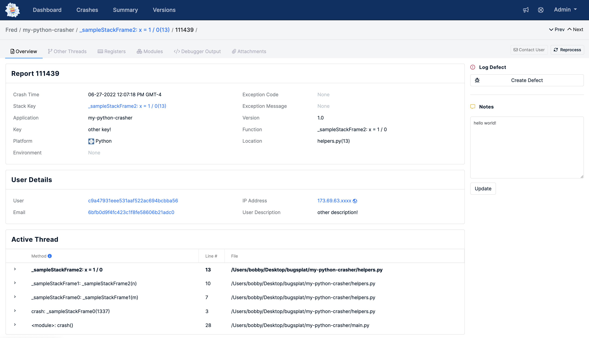

[](https://bugsplat.com)
<br/>
# <div align="center">BugSplat</div> 
### **<div align="center">Crash and error reporting built for busy developers.</div>**
<div align="center">
    <a href="https://twitter.com/BugSplatCo">
        
    </a>
    <a href="https://discord.gg/K4KjjRV5ve">
        
    </a>
</div>

## 👋 Introduction

This repo contains a usage example for [bugsplat-py](https://github.com/BugSplat-Git/bugsplat-py). The sample demonstrates how to post a Python [Exception](https://docs.python.org/3/tutorial/errors.html) from a [try/except](https://docs.python.org/3/tutorial/errors.html#handling-exceptions) block to [BugSplat](https://bugsplat.com).

## ✅ Prerequisites

* Create a [BugSplat](https://app.bugsplat.com/v2/sign-up) account
* Complete the [Onboarding](https://app.bugsplat.com/v2/welcome) workflow and note the name of your BugSplat database


## 📋 Steps

1. Clone this repo

```sh
git clone https://github.com/BugSplat-Git/my-python-crasher
```

2. Create a virtual environment

```sh
python -m venv venv
```

3. Activate the virtual environment

```sh
# unix/macos
source venv/bin/activate

# windows
.\env\Scripts\activate
```

4. Install the project's dependencies

```sh
pip install -r requirements.txt
```

5. Set the value of `database` to the name of your BugSplat database in [main.py](./main.py)

5. Run the [main.py](./main.py) script

```sh
python main.py
```

6. Navigate to the [Crashes](https://app.bugsplat.com/v2/crashes) page on BugSplat
7. Click the link in the ID column to see the details of your crash report
8. If everything worked correctly you should see something that resembles the following



## 👷 Support

If you have any additional questions, please email or [support](mailto:support@bugsplat.com) team, join us on [Discord](https://discord.gg/K4KjjRV5ve), or reach out via the chat in our web application.